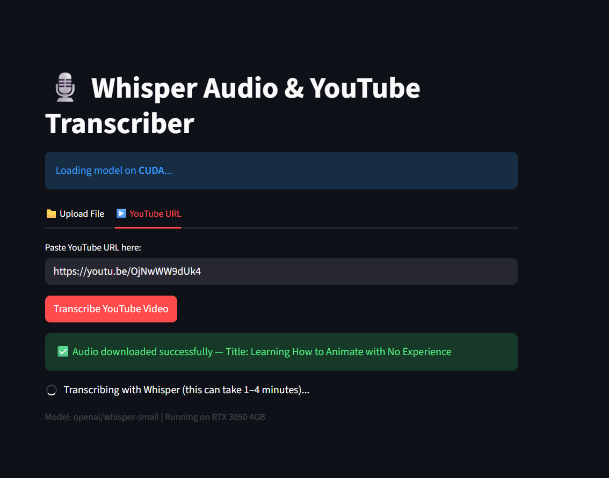
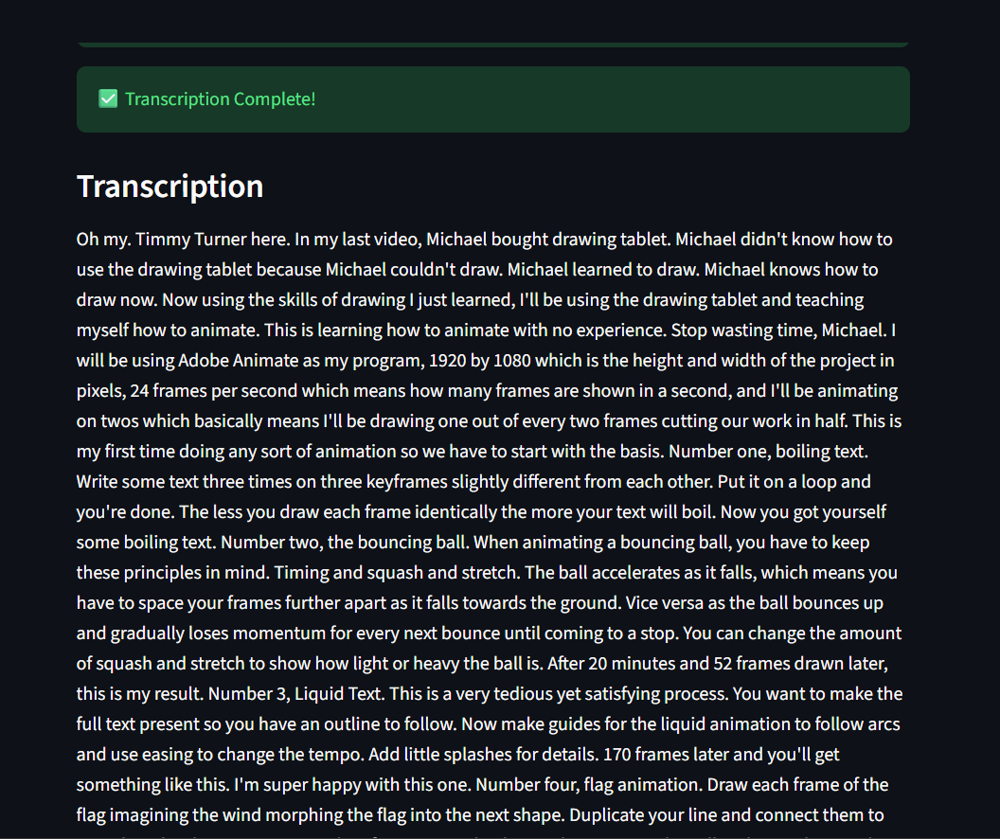
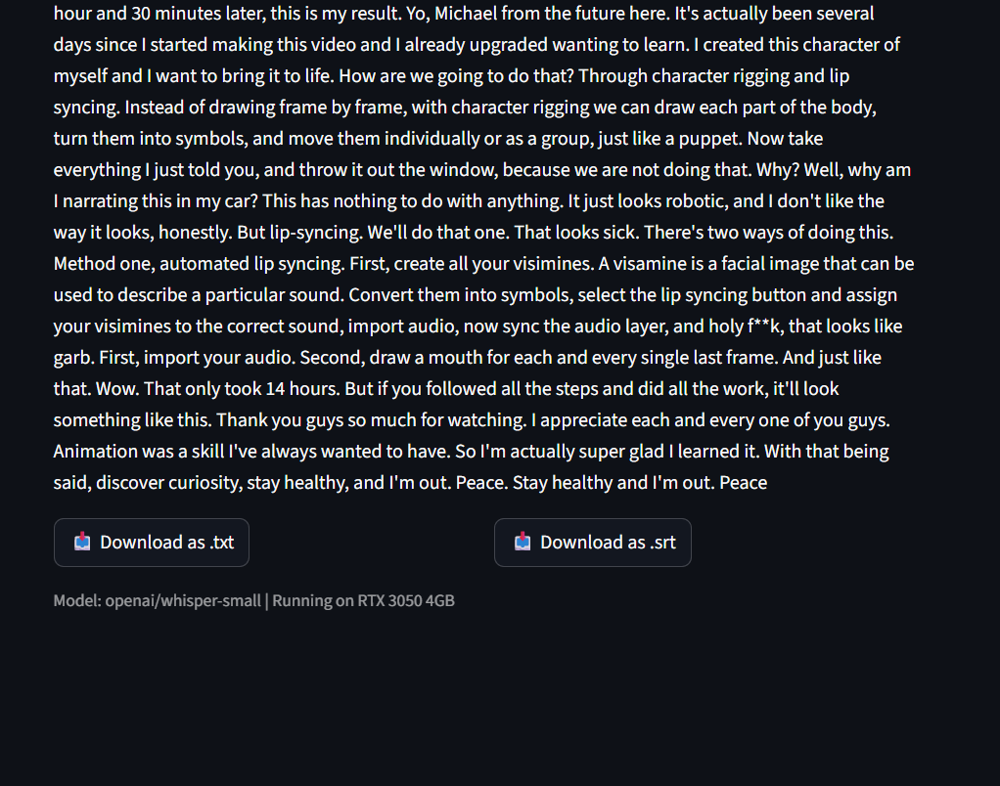
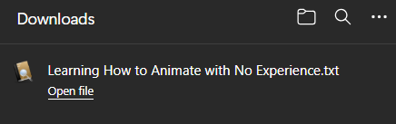

# 🎙️ Whisper Audio & YouTube Transcriber

A simple and fast web app to transcribe audio files and YouTube videos using OpenAI's **Whisper Small** model.

Built with **Streamlit** and optimized for consumer GPUs like the **NVIDIA RTX 3050 4GB**.

## ✨ Features

- Transcribe audio files (mp3, wav, m4a, etc.)
- Support for **YouTube video URLs** (automatically downloads audio)
- Powered by **openai/whisper-small**
- Clean and user-friendly interface
- Optimized for local GPU usage
- Fast transcription with caching

## ✨ Example Usecase

